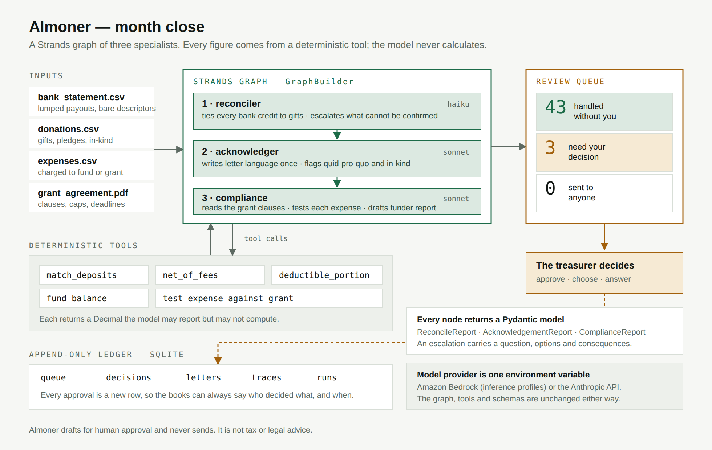

# Almoner

**The back-office agent for nonprofits too small to have a back office.**

Built with the [Strands Agents SDK](https://strandsagents.com) for the Agents for Humans hackathon — Good Neighbor track.

---

## The problem

Meena is the volunteer treasurer of a four-person literacy nonprofit. She has a day job.

Every month she spends a Sunday afternoon doing the same paperwork. Her donation platform
pays out weekly in lumps, so a single $1,156.53 deposit has to be traced back to eight
individual gifts, net of processing fees, before anyone can be thanked. Every donor is owed
a written acknowledgement with specific required language — and the awkward ones, a gala
ticket or a donated laptop, have their own rules she has to look up again each time. And
because one of her grants is restricted, she has to prove to the funder that the money went
only where the agreement allows.

None of it is hard. All of it is exacting, and the cost of a mistake lands on someone else:
a donor who cannot claim their deduction, or a funder who claws back a grant.

There are hundreds of thousands of organisations like hers — below the size where anyone
hires a bookkeeper, above the size where this fits in a shoebox.

## What Almoner does

It takes the month's records and does the work, then asks Meena about the handful of things
it genuinely cannot decide.

| | |
|---|---|
| **Reconciles** | Ties every bank credit to the gifts that produced it, including lumped platform payouts net of fees |
| **Acknowledges** | Drafts each donor's written acknowledgement, handling quid-pro-quo and in-kind gifts correctly |
| **Checks compliance** | Reads the grant agreement, tests each expense against its clauses, drafts the funder report |

On the sample month that ships with this repository, Almoner reviews 46 items and reports:

> **43 handled without you · 3 need your decision · 0 sent to anyone**

That last number never changes. Almoner drafts; a human sends.

### The three it asks about

These are not failures. They are the cases where the records genuinely do not contain the answer.

1. **A $500 check deposit with no matching donor record.** There is an unpaid $500 pledge from
   Robert Hoffmann on file. It may be that pledge being paid, or an unrelated gift. Only the
   physical check says which, and guessing either credits a donor who did not give or leaves a
   real donor unacknowledged. So Almoner asks, and offers both options with their consequences.

2. **A $250 gala ticket whose fair market value was never recorded.** Only the amount above the
   value of the dinner received is deductible. That value is not in the data, so the deductible
   portion cannot be computed — and inventing one would put a wrong number on a tax document.

3. **A $1,200 laptop charged to a restricted grant.** Clause 6(b) of the agreement forbids
   applying grant funds to any single capital item over $1,000 without prior written approval,
   and clause 6(c) makes the overage refundable. Almoner cites the clause and offers the two
   real remedies: seek retrospective approval, or move the cost to unrestricted funds.

### One it does *not* ask about

Six refurbished laptops arrive as an in-kind gift. Almoner writes the letter itself, describing
the property and stating **no value** — because a charity describes a donated item and the donor
values it. Knowing the rule is the job. Asking would have been the easy way out.

## Architecture



Three agents in a Strands `Graph`, each a narrow specialist with its own system prompt, its own
tool subset, and its own Pydantic output model. There is no general-purpose "do the bookkeeping"
prompt anywhere in this codebase.

### The one design decision that matters

**The model is not allowed to do arithmetic.**

Every figure — payout totals, processing fees, deductible portions, fund balances, the clause
6(b) threshold test — is produced by a plain Python function in [`almoner/core.py`](almoner/core.py),
which imports nothing from Strands and calls no model. The agents may *report* those numbers and
must *reason* about what they mean, but they cannot compute them. The system prompt states this
as a prohibition:

> You do not calculate. Every figure you report must come from a tool call. If you need a number
> no tool gives you, that is an escalation, not an estimate.

This is what makes the output safe to put in front of a donor. An agent that hallucinates a total
on a tax acknowledgement is worse than no agent at all.

The same split applies to the grant agreement. *Reading* clause 6(b) and understanding what it
requires is judgment, and the model does it. *Comparing $1,200 to $1,000* is arithmetic, and
`test_expense_against_grant` does that, exactly, every time.

### Escalation is structural, not a confidence threshold

`match_deposits` returns `ambiguous` with the Hoffmann pledge as a **candidate**, never as an
answer. That is a rule in Python, not a hope about the model's calibration. Each escalation
carries a question, at least two options, and the consequence of each — because an escalation
with no choices is just an error message.

### Everything is append-only

A treasurer's approval is a new row in the ledger, never an update. The books can always answer
who decided what, and when.

## Quickstart

```bash
git clone https://github.com/Sudheer-029/Almoner_agent_for_human_AWS.git
cd Almoner_agent_for_human_AWS
python3 -m venv .venv && source .venv/bin/activate
pip install -r requirements.txt
```

**See it work with no cloud account and no cost:**

```bash
python -m almoner.run --dry-run
```

This runs the full deterministic pipeline — reconciliation, classification, compliance testing —
and prints the queue. No model is called. It exists so the system can be inspected, tested and
demonstrated without spending a token.

**Open the review queue:**

```bash
./run_web.sh          # then open http://localhost:8000
```

**Run the agents:**

```bash
export AWS_REGION=us-west-2
python -m almoner.run
```

## Model configuration

Strands is model-portable, so the provider is a single environment variable and the graph, tools
and schemas are unchanged either way.

```bash
# Amazon Bedrock (default)
export AWS_REGION=us-west-2
python -m almoner.run

# Anthropic API
pip install 'strands-agents[anthropic]'
export ALMONER_PROVIDER=anthropic
export ANTHROPIC_API_KEY=...
python -m almoner.run
```

**A note on Bedrock model identifiers.** Many accounts expose no on-demand foundation models at
all, only *inference profiles*. In those accounts a bare id such as `anthropic.claude-sonnet-5`
is rejected with `The provided model identifier is invalid`. The defaults here are cross-region
inference profiles, which is why they work:

```
global.anthropic.claude-sonnet-5                    # judgment nodes
global.anthropic.claude-haiku-4-5-20251001-v1:0     # reconciler
```

Override with `ALMONER_JUDGMENT_MODEL` and `ALMONER_ROUTINE_MODEL`. To see what your own account
accepts, run `python scripts/list_models.py`.

## The sample data

`fixtures/` contains one month for a fictional organisation, Kalyani Literacy Trust — a 501(c)(3)
in Fremont, California. It is generated, not hand-written, by `scripts/generate_fixtures.py`, so
it can be regenerated and varied:

- `bank_statement_2026_08.csv` — lumped platform payouts and bare descriptors
- `donations_givepath_2026_08.csv` — 30 settled gifts plus one unpaid pledge
- `expenses_2026_08.csv` — ten expenses across the general and restricted funds
- `grant_agreement_BLF-2026.pdf` — a real four-page agreement with the cap in clause 6(b)
- `EXPECTED.md` — what a correct run must produce, and why each escalation is genuine

## Tests

```bash
python -m pytest tests/ -q
```

21 tests. Each pins a number that appears on screen — including
`test_the_counter_reads_43_handled_3_for_you`, which asserts the exact three references that
should escalate. If a prompt change breaks the demo's headline number, the suite says so in
under a second.

## Project layout

```
almoner/
  core.py        deterministic logic — no Strands import, no model calls
  money.py       Decimal only; refuses to take a float at face value
  tools.py       @tool wrappers over core.py
  schemas.py     Pydantic models every node must answer in
  agents.py      three agents, one Graph
  ledger.py      append-only SQLite
  run.py         month close, with --dry-run
  web.py         the review queue
scripts/         fixture generator, model lister
tests/           21 tests
docs/            architecture diagram
```

## Limitations, stated plainly

- **It drafts; it never sends.** There is no send path in the codebase. The "0 sent to anyone"
  counter is not a setting.
- **It is not tax or legal advice.** It applies documented rules to records and shows its
  reasoning; a human approves every outbound document.
- **It reads files, not live accounts.** No bank, payment-processor or email integration. That is
  a deliberate scope decision: the judgment layer is the interesting part, and file ingestion is
  enough to demonstrate it honestly.
- **Receipt images are out of scope.** Expenses arrive as a ledger, not as photographs.
- **One organisation, one month.** No multi-tenancy, no authentication.

## Licence

MIT. See [LICENSE](LICENSE).
